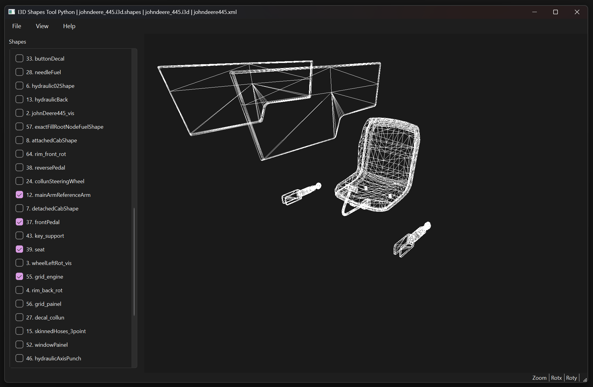

# I3DShapesToolPython

A Python tool for extracting, previewing, modifying, and rebuilding binary .i3d.shapes files used by the GIANTS Engine (Farming Simulator).

This project is based on the original C# version:
https://github.com/Donkie/I3DShapesTool

It extends the original functionality with a PyQt6 GUI and a 3D OpenGL preview, enabling interactive inspection and transformation of shapes.

## Features

- Extract meshes from binary .i3d.shapes files

- GUI built with PyQt6

- Real-time 3D OpenGL preview

- Load additional .i3d and .xml files for shape transitions and transformations (TODO)

- export: .obj .stl (single mesh or combined) (TODO)

- Reload modified .obj .stl meshes (TODO)

- Save changes back into .i3d.shapes files (TODO)

## Screenshot

## Usage

### Install dependencies:

`pip install -r requirements.txt`

### Run the application:

basic: `python main.py`

test file: `python main.py data/johnDeere_445.i3d.shapes`

test file with .i3d and .xml files: `python main.py data/johnDeere_445.i3d.shapes data/johnDeere_445.i3d data/johnDeere445.xml`

test file in CLI mode: `python main.py --nogui data/johnDeere_445.i3d.shapes`

## Requirements

- Python 3.10+
- PySide6
- PyOpenGL
- NumPy